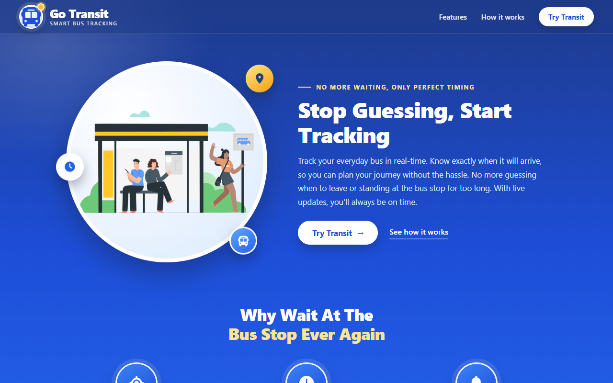
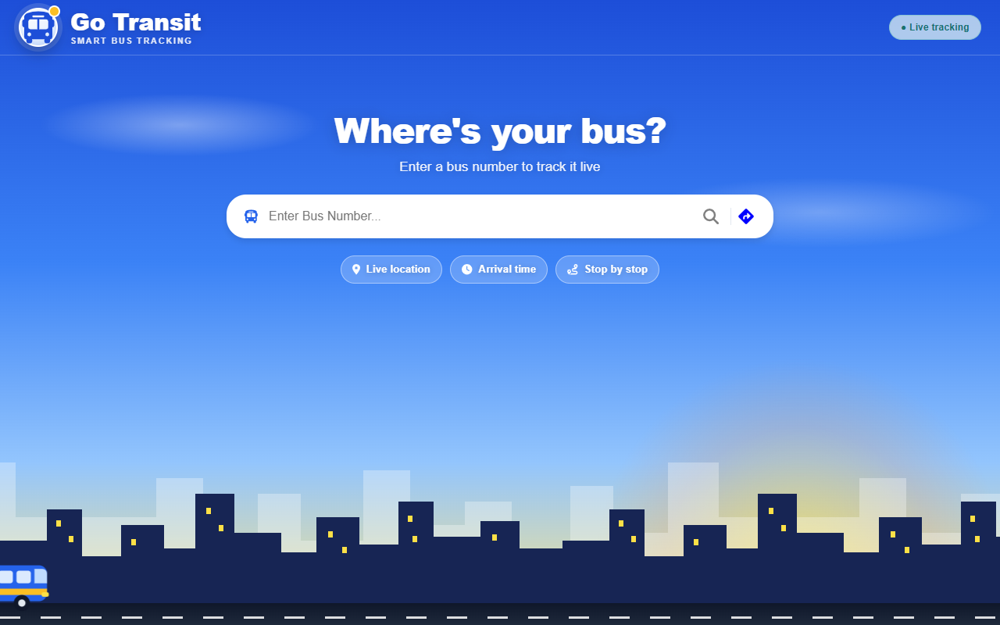
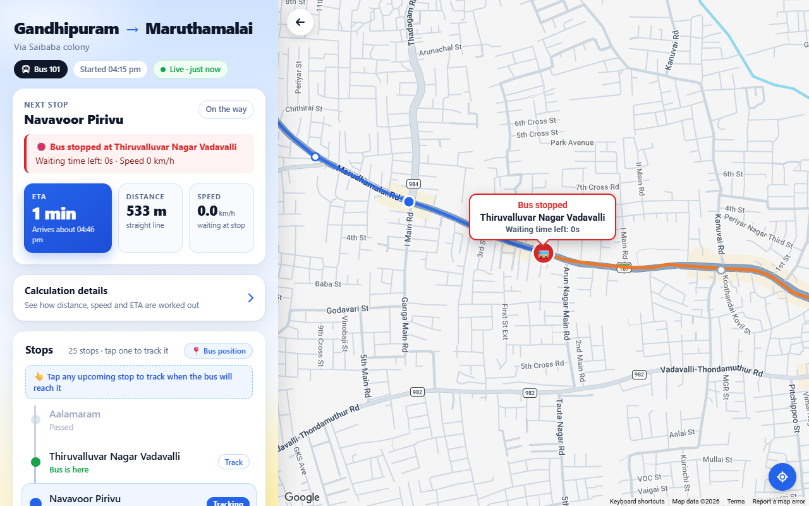

# Go Transit

[](https://gotransit-iota.vercel.app)

Real-time bus tracking web app. Search a bus by number, or plan a trip from one stop to another, then watch the bus move on a live map with its next stop, speed, distance and ETA.

> **Note:** there is no real GPS hardware in this project. The bus positions are **simulated** along a real route in Coimbatore. The simulator produces realistic driving (acceleration and braking, waiting at stops, slow traffic), and the rest of the system treats that feed exactly as it would treat real GPS data.

## Screenshots

| Landing page | Search page |
|---|---|
|  |  |

**Live trip page:** the bus moves on the map (orange road covered, blue road ahead), with the next stop, ETA, distance, speed and the stop list.



## Features

- **Two ways to search:** by bus number, or by From / To stops (partial names such as "Saibaba" work).
- **Live map** that follows the bus, with the route drawn in two colours: covered (orange) and remaining (blue).
- **Stop list** with Passed / Tracking / distance for every stop. Pick any upcoming stop to track its ETA.
- **Live status:** running, waiting at a stop (with a countdown), slow traffic, and trip start time.
- **ETA, distance and speed** calculated from the bus's live position.
- A "Live · just now" indicator that turns to *Delayed* or *Signal lost* if the feed goes stale.

## Tech stack

| Part | Technology |
|---|---|
| Frontend | React 19, Vite, React Router, Google Maps JavaScript API |
| Backend | Node.js, Express |
| Database | Firebase Realtime Database |
| Tests | Vitest |

## How it works

```
 Browser (React)  ── search ──▶  Express API  ── reads ──▶  Firebase Realtime DB
        ▲                              │                          ▲
        │                              └── bus simulator ── writes every 2 s
        └──────────── live bus location (read directly from Firebase) ─────────┘
```

1. The **backend** keeps a bus simulator running. Every 2 seconds it writes each bus's position, speed and status to Firebase.
2. The **search API** (`GET /search`) looks up a bus or a route and returns its stops and path.
3. The **frontend** listens to the bus's location in Firebase and updates the map, ETA and stop list as it changes.

## Known limitations and ideas

- Bus positions are simulated, and each route runs in one direction only.
- There is one demo route (Gandhipuram to Maruthamalai) with one bus (101).
- Ideas for next steps: return trips and timetables, real GPS from a driver's phone, driver and passenger logins, an admin page to add routes, and notifications ("your bus is 5 minutes away").
